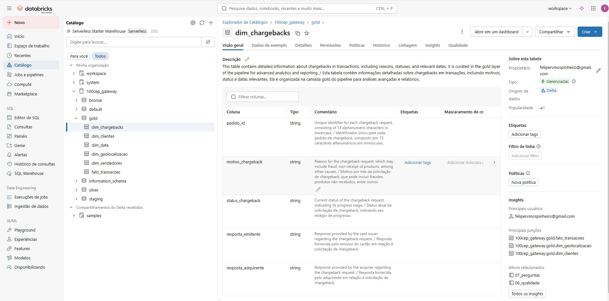
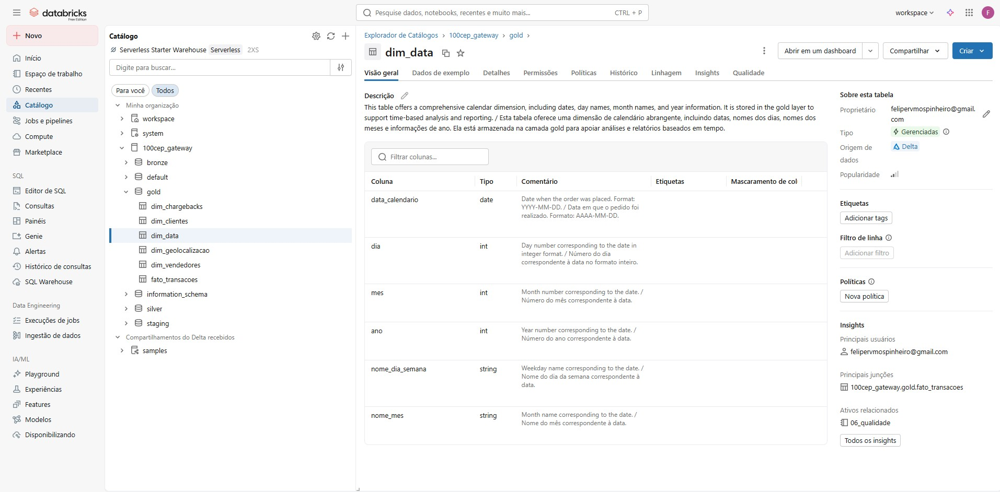
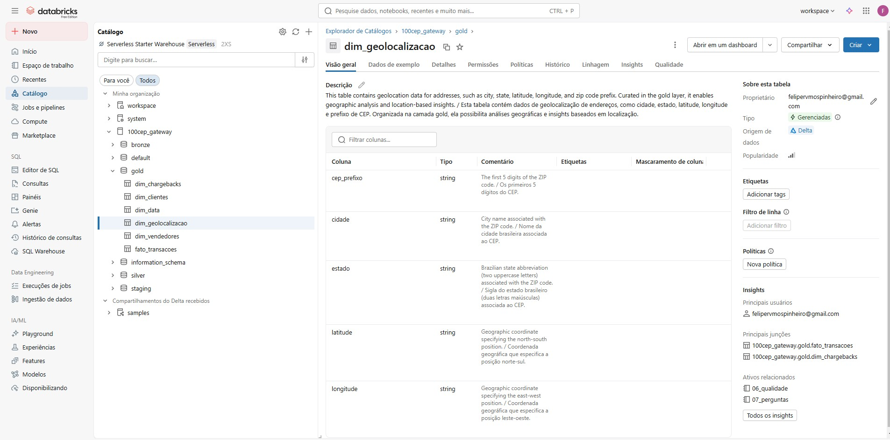
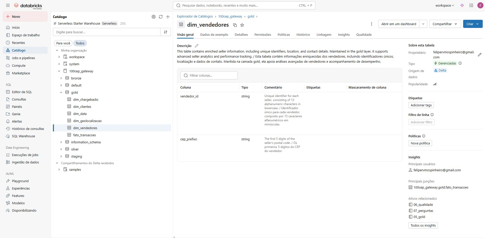
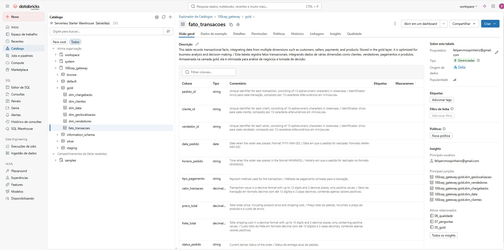
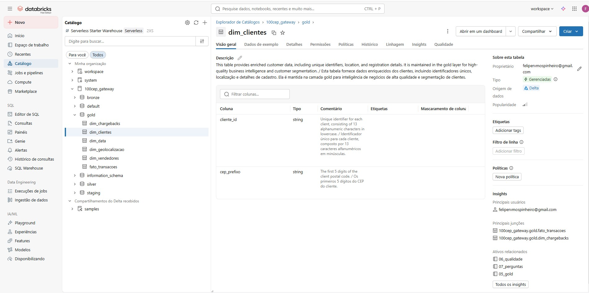

<h1 align="center">Catálogo de Dados — 100cep Gateway</h1>

<p align="center">
  
  
  
</p>

---

## 📚 Sobre este Catálogo

Este documento contém a **documentação completa** do modelo de dados da camada **Gold** do MVP 100cep Gateway. O modelo foi estruturado seguindo princípios de **Data Warehouse dimensional**, otimizado para análises de negócio.

---

### Tabela de Relacionamentos

| Tabela Origem | Coluna FK | Tabela Destino | Coluna PK | Cardinalidade |
|--------------|-----------|----------------|-----------|---------------|
| **fato_transacoes** | cliente_id | dim_clientes | cliente_id | N:1 |
| **fato_transacoes** | vendedor_id | dim_vendedores | vendedor_id | N:1 |
| **fato_transacoes** | data_pedido | dim_data | data_calendario | N:1 |
| **fato_transacoes** | pedido_id | dim_chargebacks | pedido_id | N:0,1 |
| **dim_clientes** | cep_prefixo | dim_geolocalizacao | cep_prefixo | N:1 |
| **dim_vendedores** | cep_prefixo | dim_geolocalizacao | cep_prefixo | N:1 |

**Nota**: Nem todos os pedidos possuem chargeback.

---

<h2 align="center">⚠️ DIMENSÃO: dim_chargebacks</h2>

**Tipo**: Dimensão de Eventos (Event Dimension)  
**Granularidade**: 1 registro = 1 solicitação de chargeback  
**Registros**: ~1.000 chargebacks

<p align="center"> </p>

| Coluna | Tipo | Descrição | Description | 
| ------ | ---- | --------- | ----------- | 
| pedido_id | string | Identificador único para cada pedido de chargeback, composto por 13 caracteres alfanuméricos em minúsculas. | Unique identifier for each chargeback request, consisting of 13 alphanumeric characters in lowercase. |
| motivo_chargeback | string | Motivo por trás da solicitação de chargeback, que pode incluir fraudes, produtos não recebidos, entre outros. | Reason for the chargeback request, which may include fraud, non-receipt of products, among other causes. |
| status_chargeback | string | Status atual da solicitação de chargeback, indicando seu estágio de progresso.  | Current status of the chargeback request, indicating its progress stage.|
| resposta_emitente | string | Resposta fornecida pelo emissor do cartão em relação à solicitação de chargeback. | Response provided by the card issuer regarding the chargeback request. |
| resposta_adquirente | string | Resposta fornecida pelo adquirente em relação à solicitação de chargeback. | Response provided by the acquirer regarding the chargeback request. |

**Domínios de Valores**:
- `motivo_chargeback`: Fraud, Product not received, Product defective, Service issue, Unauthorized transaction, etc.
- `status_chargeback`: pending, approved, denied, investigating, closed
- `resposta_emitente`: Approved, Denied, Under Review, Pending Documentation
- `resposta_adquirente`: Accepted, Rejected, Requesting Evidence, Processing

**Regras de Negócio**:
- ✅ Nem todos os pedidos possuem chargeback (relação 1:0..1)
- ✅ Chargebacks são gerados por dataset adicional (AI-generated)
- ✅ Usado para análises de risco e fraud detection

**Uso**:
- Análise de taxa de chargeback
- Identificação de padrões de fraude
- Avaliação de risco por método de pagamento/região
- Monitoramento de perdas financeiras

---

<h2 align="center">dim_data</h2>

<p align="center"> </p>

| Coluna | Tipo | Descrição | Description | 
| ------ | ---- | --------- | ----------- | 
| data_calendario | date | Data em que o pedido foi realizado. Formato: AAAA-MM-DD.| Date when the order was placed. Format: YYYY-MM-DD. |
| dia | int | Número do dia correspondente à data no formato inteiro. | Day number corresponding to the date in integer format. |
| mes | int | Número do mês correspondente à data. | Month number corresponding to the date. |
| ano | int | Número do ano correspondente à data. | Year number corresponding to the date. |
| nome_dia_semana | string | Nome do dia da semana correspondente à data. | Weekday name corresponding to the date. |
| nome_mes | string | Nome do mês correspondente à data. | Month name corresponding to the date. |
**Uso**:
- Identificação de vendedores em transações
- Análise de performance por vendedor
- Análise geográfica de vendedores

---

<h2 align="center">dim_geolocalizacao</h2>

**Tipo**: Dimensão Geográfica (Geography Dimension)  
**Granularidade**: 1 registro = 1 prefixo de CEP (5 dígitos)  
**Registros**: ~19.000 prefixos de CEP

<p align="center"> </p>

| Coluna | Tipo | Descrição | Description | 
| ------ | ---- | --------- | ----------- | 
| cep_prefixo | string | Os primeiros 5 dígitos do CEP. | The first 5 digits of the ZIP code. |
| cidade | string | Nome da cidade brasileira associada ao CEP. | City name associated with the ZIP code. |
| estado | string | Sigla do estado brasileiro (duas letras maiúsculas) associada ao CEP. | Brazilian state abbreviation (two uppercase letters) associated with the ZIP code. |
| latitude | string | Coordenada geográfica que especifica a posição norte-sul. | Geographic coordinate specifying the north-south position. |
| longitude | string | Coordenada geográfica que especifica a posição leste-oeste. | Geographic coordinate specifying the east-west position. |
**Uso**:
- Identificação de clientes em transações
- Análise geográfica (via `cep_prefixo`)
- Segmentação de clientes por região

---

<h2 align="center">dim_vendedores</h2>

**Tipo**: Dimensão (Dimension Table)  
**Granularidade**: 1 registro = 1 vendedor (seller)  
**Registros**: ~3.000 vendedores

<p align="center"> </p>

| Coluna | Tipo | Descrição | Description | 
| ------ | ---- | --------- | ----------- | 
| vendedor_id | string | Identificador único para cada vendedor, composto por 13 caracteres alfanuméricos em minúsculas. | Unique identifier for each seller, consisting of 13 alphanumeric characters in lowercase. |
| cep_prefixo | string | Os primeiros 5 dígitos do CEP do vendedor. | The first 5 digits of the seller's postal code. |

<h2 align="center">fato_transacoes</h2>

**Tipo**: Tabela Fato (Fact Table)  
**Granularidade**: 1 registro = 1 transação de pagamento por pedido  
**Registros**: ~99.000 transações

<p align="center"> </p>

| Coluna | Tipo | Descrição | Description | 
| ------ | ---- | --------- | ----------- | 
| pedido_id | string | Identificador único para cada transação, composto por 13 caracteres alfanuméricos em minúsculas. | Unique identifier for each transaction, consisting of 13 alphanumeric characters in lowercase. |
| cliente_id | string | Identificador único para cada cliente, composto por 13 caracteres alfanuméricos em minúsculas. | Unique identifier for each client, consisting of 13 alphanumeric characters in lowercase. |
| vendedor_id | string | Identificador único para cada vendedor, composto por 13 caracteres alfanuméricos em minúsculas. | Unique identifier for each seller, consisting of 13 alphanumeric characters in lowercase. |
| data_pedido | date | Data em que o pedido foi realizado. Formato: AAAA-MM-DD. | Date when the order was placed. Format: YYYY-MM-DD.|
| horario_pedido | date | Horário em que o pedido foi realizado no formato HH:MM:SS.| Time when the order was placed in the format HH:MM:SS. |
| tipo_pagamento | string | Método de pagamento utilizado para a transação.| Payment method used for the transaction |
| valor_transacao | decimal(12,2) | Valor da transação em formato decimal com até 12 dígitos e 2 casas decimais, contendo apenas valores positivos. | Transaction value in a decimal format with up to 12 digits and 2 decimal places, only positive values. |
| preco_total | decimal(16,2) | Preço total do pedido, incluindo o preço do produto e o custo de envio. | Total order price, including product price and shipping cost. |
| frete_total | decimal(15,2) | Custo total do frete em formato decimal com até 15 dígitos e 2 casas decimais, contendo apenas valores positivos. | Total shipping cost in a decimal format with up to 15 digits and 2 decimal places, only containing positive values. |
| status_pedido | string | Status de entrega atual do pedido. | Current deliver status of the order. |

**Domínios de Valores**:
- `tipo_pagamento`: credit_card, boleto, voucher, debit_card
- `status_pedido`: delivered, shipped, canceled, processing, unavailable, invoiced

**Regras de Negócio**:
- ✅ Apenas pedidos com status "delivered" são incluídos
- ✅ `preco_total` = soma de todos os itens do pedido
- ✅ `frete_total` = soma de todos os fretes dos itens
- ✅ `valor_transacao` pode ser diferente de `preco_total` (pagamentos múltiplos)

---

<h2 align="center">dim_data</h2>

**Tipo**: Dimensão Temporal (Time Dimension)  
**Granularidade**: 1 registro = 1 dia  
**Registros**: ~365 dias (2016-2018)

<p align="center"> </p>

| Coluna | Tipo | Descrição | Description | 
| ------ | ---- | --------- | ----------- | 
| data_calendario | date | Data em que o pedido foi realizado. Formato: AAAA-MM-DD.| Date when the order was placed. Format: YYYY-MM-DD. |
| dia | int | Número do dia correspondente à data no formato inteiro. | Day number corresponding to the date in integer format. |
| mes | int | Número do mês correspondente à data. | Month number corresponding to the date. |
| ano | int | Número do ano correspondente à data. | Year number corresponding to the date. |
| nome_dia_semana | string | Nome do dia da semana correspondente à data. | Weekday name corresponding to the date. |
| nome_mes | string | Nome do mês correspondente à data. | Month name corresponding to the date. |

**Domínios de Valores**:
- `dia`: 1-31
- `mes`: 1-12
- `ano`: 2016-2018
- `nome_dia_semana`: Segunda, Terça, Quarta, Quinta, Sexta, Sábado, Domingo
- `nome_mes`: Janeiro, Fevereiro, Março, ..., Dezembro

---

<h2 align="center">dim_clientes</h2>

**Tipo**: Dimensão (Dimension Table)  
**Granularidade**: 1 registro = 1 cliente  
**Registros**: ~99.000 clientes

<p align="center"> </p>

| Coluna | Tipo | Descrição | Description | 
| ------ | ---- | --------- | ----------- | 
| cliente_id | string | Identificador único para cada cliente, composto por 13 caracteres alfanuméricos em minúsculas. | Unique identifier for each client, consisting of 13 alphanumeric characters in lowercase. |
| cep_prefixo | string | Os primeiros 5 dígitos do CEP do cliente. | The first 5 digits of the client postal code. |

---

<h2 align="center">dim_vendedores</h2>

**Tipo**: Dimensão (Dimension Table)  
**Granularidade**: 1 registro = 1 vendedor (seller)  
**Registros**: ~3.000 vendedores

<p align="center"> </p>

| Coluna | Tipo | Descrição | Description | 
| ------ | ---- | --------- | ----------- | 
| vendedor_id | string | Identificador único para cada vendedor, composto por 13 caracteres alfanuméricos em minúsculas. | Unique identifier for each seller, consisting of 13 alphanumeric characters in lowercase. |
| cep_prefixo | string | Os primeiros 5 dígitos do CEP do vendedor. | The first 5 digits of the seller's postal code. |

---

<h2 align="center">dim_geolocalizacao</h2>

**Tipo**: Dimensão Geográfica (Geography Dimension)  
**Granularidade**: 1 registro = 1 prefixo de CEP (5 dígitos)  
**Registros**: ~19.000 prefixos de CEP

<p align="center"> </p>

| Coluna | Tipo | Descrição | Description | 
| ------ | ---- | --------- | ----------- | 
| cep_prefixo | string | Os primeiros 5 dígitos do CEP. | The first 5 digits of the ZIP code. |
| cidade | string | Nome da cidade brasileira associada ao CEP. | City name associated with the ZIP code. |
| estado | string | Sigla do estado brasileiro (duas letras maiúsculas) associada ao CEP. | Brazilian state abbreviation (two uppercase letters) associated with the ZIP code. |
| latitude | string | Coordenada geográfica que especifica a posição norte-sul. | Geographic coordinate specifying the north-south position. |
| longitude | string | Coordenada geográfica que especifica a posição leste-oeste. | Geographic coordinate specifying the east-west position. |

**Domínios de Valores**:
- `estado`: Siglas dos 27 estados brasileiros (AC, AL, AM, AP, BA, CE, DF, ES, GO, MA, MG, MS, MT, PA, PB, PE, PI, PR, RJ, RN, RO, RR, RS, SC, SE, SP, TO)
- `latitude`: -33.75 a 5.27 (limites do Brasil)
- `longitude`: -73.99 a -34.79 (limites do Brasil)

---

## 🔗 Linhagem de Dados

### Fluxo de Transformação

```
📂 Kaggle CSV Files
    ↓
💾 Unity Catalog Volumes
    ↓
🟫 Bronze Layer (Raw)
    ├─ bronze_customers
    ├─ bronze_orders
    ├─ bronze_order_payments
    ├─ bronze_order_items
    ├─ bronze_sellers
    ├─ bronze_geolocation
    └─ bronze_chargebacks
    ↓
🧹 Silver Layer (Cleaned)
    ├─ silver_customers      [limpeza + validação]
    ├─ silver_orders        [conversão temporal]
    ├─ silver_order_payments [agregação]
    ├─ silver_order_items    [agregação]
    ├─ silver_sellers       [padronização]
    ├─ silver_geolocation   [deduplicação]
    └─ silver_chargebacks   [enriquecimento]
    ↓
🏆 Gold Layer (Analytics) ← VOCÊ ESTÁ AQUI!
    ├─ fato_transacoes
    ├─ dim_data
    ├─ dim_clientes
    ├─ dim_vendedores
    ├─ dim_geolocalizacao
    └─ dim_chargebacks
```

### Mapeamento de Colunas (Principais)

| Origem (Kaggle) | Bronze | Silver | Gold | Transformação |
|----------------|--------|--------|------|----------------|
| order_id | order_id | pedido_id | pedido_id | Tradução |
| customer_id | customer_id | cliente_id | cliente_id | Tradução |
| order_purchase_timestamp | order_purchase_timestamp | data_compra (TIMESTAMP) | data_pedido (DATE) | Conversão + Split |
| payment_value | payment_value (STRING) | valor_pagamento (DECIMAL) | valor_transacao (DECIMAL) | Type cast + Agregação |
| zip_code_prefix | zip_code_prefix | cep_prefixo | cep_prefixo | Tradução |

**Documentação completa das transformações**: [/docs/etl.md](./etl.md)

---

## ✅ Validações de Qualidade

- [x] Chaves primárias únicas (sem duplicatas)
- [x] Chaves estrangeiras válidas (integridade referencial)
- [x] Tipos de dados corretos e consistentes
- [x] Valores dentro dos domínios esperados
- [x] Nulos apenas em campos opcionais
- [x] Coordenadas geográficas dentro dos limites do Brasil
- [x] Datas no range esperado (2016-2018)
- [x] Valores numéricos positivos (exceto lat/long)

---

<p align="center">
  <strong>👍 Catálogo mantido e atualizado pela equipe de Data Engineering da 100cep Gateway</strong>
</p>